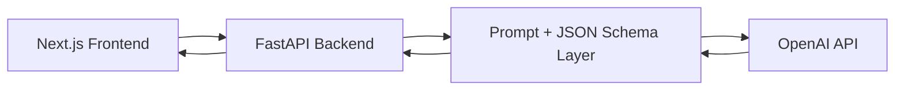

# NutriLens

## AI Nutrition Copilot for Preventive Health

**NutriLens helps people turn everyday meal choices into early preventive-health action.**

Instead of acting like a passive calorie tracker, NutriLens interprets food inputs as health signals. A user can upload a meal, compare two options, or summarize a full day of eating, and the system responds with a clear risk pattern, practical guidance, and the single next best intervention.

Built as a full-stack healthcare hackathon prototype, NutriLens is designed to answer one simple question:

**How can AI help people make better nutrition decisions before poor habits become health problems?**

## The Problem

Most nutrition tools ask users to log more, read more, and decide more.

That breaks down quickly in real life:

- food logging is tedious
- nutrition labels are hard to interpret in context
- most people do not know what matters most in a meal
- existing apps often return data, but not a decision

The result is a gap between **nutrition awareness** and **useful action**.

## Our Approach

NutriLens reframes nutrition as a preventive-health workflow:

1. **Monitor the signal**  
   Capture what the user ate through image or text.

2. **Detect the pattern**  
   Identify likely nutrition tradeoffs, risk flags, and daily drift.

3. **Recommend the next best action**  
   Give one clear, practical intervention the user can act on immediately.

This makes NutriLens feel less like a tracker and more like an AI decision copilot.

## Why It Stands Out

- **Decision-first UX**: every flow ends in a recommendation, not just a report
- **Preventive-health framing**: focused on patterns, drift, and early intervention
- **Structured AI outputs**: reliable JSON schemas keep the experience stable
- **Demo-ready resilience**: fallback responses keep the app working if live AI fails
- **Healthcare-relevant story**: strong fit for wellness, coaching, insurer, and employer health use cases

## Demo Flows

### 1. Analyze Food

Upload a meal photo and NutriLens returns:

- a likely meal name
- estimated macros and nutrition
- ingredient and portion guesses
- health signals to watch
- practical next-step recommendations

### 2. Compare Meals

Describe two meal options and NutriLens:

- compares them side by side
- identifies the stronger choice for the user's goal
- explains tradeoffs clearly
- produces a structured scorecard for the frontend

### 3. Daily Monitoring

Log meals across a day and NutriLens delivers:

- a concise day summary
- the primary risk flag
- a prevention focus for the next 24 hours
- one next best intervention
- estimated daily totals, highlights, gaps, and an action plan

## What Makes This a Strong Hackathon Build

NutriLens is not just a concept deck. It is a working full-stack prototype with:

- a polished multi-page web interface
- a FastAPI backend with typed schemas
- OpenAI-powered structured reasoning
- image and text-based workflows
- stable output contracts for clean rendering

This matters in judging because the project demonstrates:

- a clear user problem
- a believable AI use case
- practical product design
- technical execution beyond a mockup

## Product Vision

NutriLens can evolve into a preventive-health companion for:

- wellness programs
- health insurers
- digital coaching platforms
- employer benefits ecosystems
- patient engagement and lifestyle support tools

The long-term opportunity is not just meal analysis. It is helping users detect unhealthy patterns earlier and intervene while the behavior is still easy to change.

## Tech Stack

- **Frontend**: Next.js 15, React 19, Tailwind CSS
- **Backend**: FastAPI, Pydantic, Uvicorn
- **AI**: OpenAI Responses API with strict JSON schema output
- **Data flow**: REST APIs with JSON and multipart form handling

## System Architecture



## Frontend Routes

- `/`
- `/analyze-food`
- `/compare-meals`
- `/daily-nutrition`

## Backend Endpoints

- `GET /health`
- `POST /analyze-food`
- `POST /compare-meals`
- `POST /daily-nutrition`

## Project Structure

```text
.
├── src/
│   ├── app/
│   │   ├── page.js
│   │   ├── analyze-food/page.js
│   │   ├── compare-meals/page.js
│   │   ├── daily-nutrition/page.js
│   │   └── layout.js
│   ├── components/
│   │   ├── json-panel.js
│   │   ├── nav-bar.js
│   │   └── page-intro.js
│   └── lib/
│       └── api.js
├── backend/
│   ├── main.py
│   ├── openai_service.py
│   ├── schemas.py
│   └── __init__.py
├── package.json
├── requirements.txt
├── .env.example
└── README.md
```

## Local Setup

### Prerequisites

- Node.js 18+
- Python 3.10+
- OpenAI API key

### 1. Install frontend dependencies

```bash
npm install
```

### 2. Create a Python virtual environment

```bash
python3.11 -m venv .venv
source .venv/bin/activate
pip install -r requirements.txt
```

### 3. Configure environment variables

Create `.env` for the backend:

```bash
OPENAI_API_KEY=your_openai_api_key
OPENAI_MODEL=gpt-5-mini
CORS_ORIGINS=http://localhost:3000,http://127.0.0.1:3000
```

Create `.env.local` for the frontend:

```bash
NEXT_PUBLIC_API_BASE_URL=http://127.0.0.1:8000
```

You can also start from `.env.example`.

### 4. Run the backend

```bash
npm run dev:api
```

### 5. Run the frontend

```bash
npm run dev:web
```

Frontend: [http://localhost:3000](http://localhost:3000)  
Backend: [http://127.0.0.1:8000](http://127.0.0.1:8000)

## API Reference

### `GET /health`

Returns:

```json
{ "status": "ok" }
```

### `POST /analyze-food`

Accepts `multipart/form-data`:

- `image`
- `notes`
- `goal`

Example:

```bash
curl -X POST http://127.0.0.1:8000/analyze-food \
  -F "image=@meal.jpg" \
  -F "notes=grilled chicken bowl with rice and vegetables" \
  -F "goal=high-protein lunch"
```

### `POST /compare-meals`

Accepts JSON:

```json
{
  "focus": "lower calorie, higher protein",
  "meal_a": {
    "name": "Chicken Wrap",
    "description": "Grilled chicken wrap with lettuce, sauce, and fries"
  },
  "meal_b": {
    "name": "Salmon Bowl",
    "description": "Salmon with brown rice, broccoli, cucumber, and avocado"
  }
}
```

### `POST /daily-nutrition`

Accepts JSON:

```json
{
  "date": "2026-03-14",
  "meals": [
    {
      "name": "Breakfast",
      "description": "Greek yogurt with berries and granola",
      "time": "08:00"
    },
    {
      "name": "Lunch",
      "description": "Chicken burrito bowl with rice, beans, salsa, and cheese",
      "time": "12:30"
    }
  ],
  "goals": {
    "focus": "stable energy",
    "calorie_target": 2000,
    "protein_target_g": 130
  }
}
```

## Reliability by Design

NutriLens validates model outputs against strict schemas. If the live OpenAI call fails, the backend returns a safe fallback response so the UI remains stable.

This is especially important in hackathon demos, where reliability matters as much as ambition.

## Limitations

- nutrition values are estimates, not clinical measurements
- outputs are intended for guidance, not diagnosis
- image quality and meal detail affect accuracy
- this prototype is designed for preventive-health support, not medical treatment

## Future Potential

- user history and trend tracking
- goal memory and personalization
- nutrition label and barcode ingestion
- wearable and health data integrations
- multilingual support
- longitudinal preventive-health insights

## Closing

NutriLens shows how AI can move nutrition from passive logging to proactive intervention.

It is a compact but credible healthcare prototype that combines:

- a sharp problem statement
- strong preventive-health positioning
- practical user flows
- structured AI reasoning
- full-stack execution

For a hackathon setting, that combination is the point: **clear value, visible product thinking, and a working technical system.**
